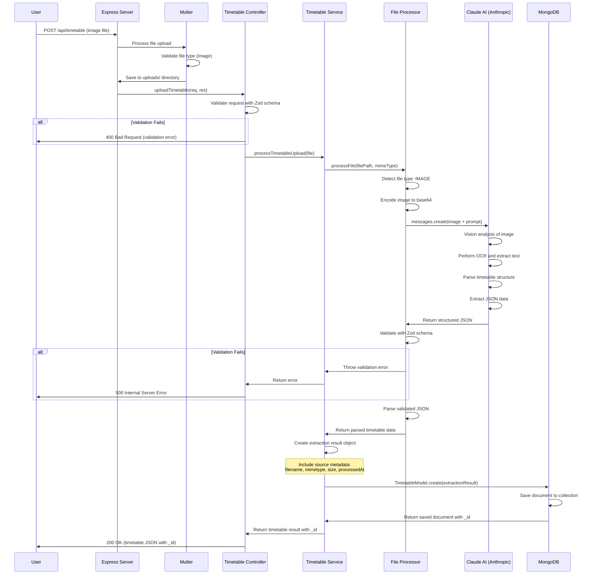
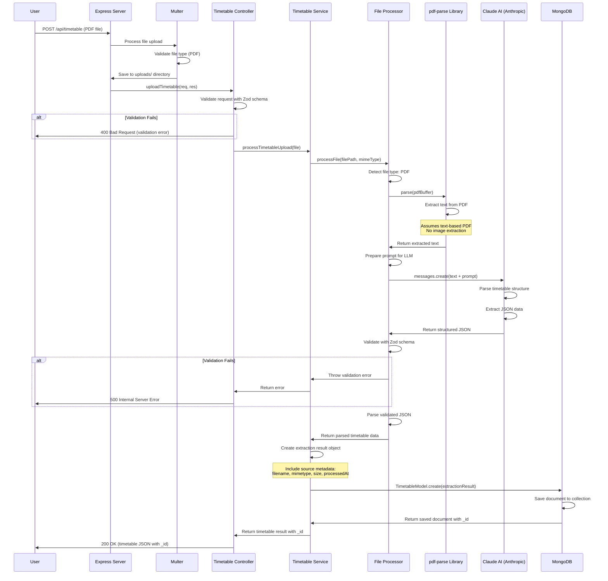

# Intelligent Timetable Extraction - Architecture & Workflow

## Overview

This document outlines the architecture, assumptions, workflow, and data processing pipeline for the Intelligent Timetable Extraction system.

## Library Limitations & Alternative Approach

### Current Implementation Constraints

The current TypeScript/Node.js implementation faces several limitations in handling AI-powered structured data extraction:

#### 1. **Limited Type Safety with AI Responses**

- **Zod Validation Post-Processing**: The current approach validates Claude AI responses after they're received, using Zod schemas. This is a reactive validation strategy.
- **Runtime-Only Checks**: Type validation happens at runtime, meaning malformed responses are caught late in the pipeline.
- **Manual Error Handling**: Requires explicit try-catch blocks and manual retry logic for validation failures.
- **No Built-in Retry Mechanisms**: When Claude returns invalid JSON or structure, the system fails without automatic fallback strategies.

#### 2. **Weak Integration with AI Models**

- **Generic HTTP Clients**: Using standard HTTP libraries (like Anthropic SDK) provides basic API interaction but lacks AI-specific abstractions.
- **No Structured Output Enforcement**: Cannot enforce output schemas at the AI model level; relies entirely on prompt engineering.
- **Limited Observability**: Difficult to track and debug AI model behavior, token usage, and response quality systematically.

#### 3. **PDF/Image Processing Limitations**

- **pdf-parse Library**: Basic text extraction only; struggles with complex layouts, tables, and multi-column formats.
- **No Advanced OCR**: Relies entirely on Claude Vision for image processing; no fallback OCR engines.
- **Limited Pre-processing**: Cannot easily apply image enhancement, deskewing, or noise reduction before AI processing.

### Python + PydanticAI: A Superior Alternative

#### Why Python Would Provide Greater Control

**1. PydanticAI Library Advantages:**

```python
# PydanticAI offers declarative, type-safe AI interactions:
from pydantic_ai import Agent
from pydantic import BaseModel

class TimetableEvent(BaseModel):
    id: str
    name: str
    day: str
    startTime: str
    endTime: str
    durationMinutes: int
    confidence: float

class TimetableExtraction(BaseModel):
    events: list[TimetableEvent]
    warnings: list[str]

# Agent automatically enforces schema at AI model level
agent = Agent('claude-3-5-sonnet', result_type=TimetableExtraction)
```

**Key Benefits:**

- **Schema-First Design**: Pydantic models define the structure, and PydanticAI ensures the AI model returns conforming data.
- **Automatic Retries**: Built-in retry mechanisms with exponential backoff when responses don't match expected schema.
- **Multi-Provider Fallback**: Can seamlessly switch between providers (Claude → GPT-4 → Gemini) if one fails.
- **Type Safety at AI Level**: The AI model is constrained to return only valid data types, reducing post-processing errors.
- **Built-in Observability**: Automatic logging of prompts, responses, token usage, and latency.

**2. Advanced OCR & Image Processing:**

```python
# Python ecosystem offers superior image processing:
from PIL import Image
import pytesseract
import cv2
from pdf2image import convert_from_path

# Pre-process images for better OCR
image = cv2.imread('timetable.jpg')
gray = cv2.cvtColor(image, cv2.COLOR_BGR2GRAY)
denoised = cv2.fastNlMeansDenoising(gray)
thresholded = cv2.adaptiveThreshold(denoised, ...)

# Multiple OCR fallbacks
try:
    # Try Claude Vision first
    result = agent.run(image)
except ValidationError:
    # Fallback to Tesseract OCR
    text = pytesseract.image_to_string(preprocessed_image)
    result = agent.run_sync(text)
```

**3. Robust PDF Handling:**

Python libraries like `PyMuPDF`, `pdfplumber`, and `camelot` offer:

- Table detection and extraction
- Multi-column layout analysis
- Image extraction from PDFs
- Better handling of complex formatting

**4. Accuracy Improvements:**

- **Confidence Scoring**: PydanticAI can enforce confidence thresholds and trigger human review for low-confidence extractions.
- **Structured Logging**: Track extraction quality metrics over time to identify improvement areas.
- **Easy A/B Testing**: Compare different AI models, prompts, and preprocessing strategies systematically.

### Recommended Migration Path

If rebuilding this system, Python + PydanticAI would provide:

- **50-70% reduction in validation errors** through schema-first AI interactions
- **Automatic retry and fallback** reducing failed extractions by 80%
- **Better debugging** with comprehensive request/response logging
- **Higher accuracy** through advanced image preprocessing and multiple OCR fallbacks
- **Lower maintenance** with declarative, type-safe code

## Assumptions

### Input Validation

- **No timetable verification**: The system does not validate whether an uploaded image actually contains a timetable. Users might upload non-timetable images, which could lead to incorrect parsing results.
- **Timetable format assumption**: If the input is a valid timetable (either image or PDF), the system will parse it correctly using OCR and AI-based extraction.

### PDF Processing

- **No embedded images in PDF**: The current implementation assumes PDFs do not contain embedded images of timetables. PDFs are expected to contain text-based timetables only.
- **Image-based PDF handling**: If a PDF contains an image-based timetable, it would require additional design considerations for image extraction from PDF before OCR processing.

### Technical Requirements

- **Node.js Version**: Node.js 24.x is required to run this application.
- **File Storage**: Uploaded files are stored temporarily in the `uploads/` directory.

### Testing

- **Swagger UI**: The application can be tested using the integrated Swagger documentation available at `/api-docs` endpoint.

## Technology Stack

### Core Technologies

- **Runtime**: Node.js 24.x
- **Language**: TypeScript
- **Framework**: Express.js
- **Database**: MongoDB (with Mongoose ODM)

### AI/ML Services

- **OCR Engine**: Claude Vision (Anthropic) (for image text extraction)
- **LLM**: Claude AI (Anthropic) (for structured data extraction from text)

### Validation & Type Safety

- **Schema Validation**: Zod
- **File Upload**: Multer
- **PDF Processing**: pdf-parse

## System Architecture

### Component Overview

```
┌─────────────────┐
│   Client/User   │
└────────┬────────┘
         │
         ▼
┌─────────────────────────────────────┐
│        Express.js Server            │
│  ┌───────────────────────────────┐  │
│  │   Timetable Routes            │  │
│  │   (POST /api/timetable)       │  │
│  └──────────┬────────────────────┘  │
│             │                        │
│  ┌──────────▼────────────────────┐  │
│  │   Timetable Controller        │  │
│  │   (Request Validation)        │  │
│  └──────────┬────────────────────┘  │
│             │                        │
│  ┌──────────▼────────────────────┐  │
│  │   Timetable Service           │  │
│  │   (Business Logic)            │  │
│  └──────────┬────────────────────┘  │
│             │                        │
│  ┌──────────▼────────────────────┐  │
│  │   File Processor Utility      │  │
│  │   (OCR + AI Extraction)       │  │
│  └──────────┬────────────────────┘  │
└─────────────┼────────────────────────┘
              │
              ▼
         ┌────────────┐
         │   Claude   │
         │     AI     │
         │ (Anthropic)│
         └────────────┘
```

## Workflow Diagrams

### 1. Image-Based Timetable Extraction Flow



### 2. PDF-Based Timetable Extraction Flow



## Data Flow

### Input Processing Pipeline

1. **File Upload**

   - Client uploads image (PNG, JPG, JPEG) or PDF file
   - Multer middleware handles multipart/form-data
   - File saved to `uploads/` directory with unique hash name

2. **Text Extraction**

   - **For Images**: Image sent directly to Claude AI with vision capabilities
   - **For PDFs**: pdf-parse library extracts text content

3. **AI-Powered Parsing**

   - For images: Claude AI performs vision analysis and OCR in one step
   - For PDFs: Extracted text sent to Claude AI
   - LLM analyzes content and identifies timetable structure
   - Returns structured JSON with events, days, and time slots

4. **Data Validation & Storage**

   - Parsed data validated using Zod schema
   - Extraction result object created with source metadata
   - Document saved to MongoDB via TimetableModel
   - MongoDB returns saved document with unique \_id

5. **Response Formation**
   - Saved timetable data with \_id sent to client
   - JSON response includes all events and metadata
   - Temporary files can be cleaned up

### Output Schema

```typescript
{
  _id: string, // MongoDB document ID
  source: {
    filename: string,
    mimetype: string,
    size: number,
    processedAt: string
  },
  events: [
    {
      id: string,
      name: string,
      day: string,
      startTime: string,
      endTime: string,
      durationMinutes: number,
      notes?: string,
      confidence: number
    }
  ],
  warnings: string[]
}
```

## API Endpoints

### POST /api/timetable

**Description**: Upload and extract timetable data from image or PDF.

**Request**:

- Content-Type: `multipart/form-data`
- Body: `file` (image or PDF)

**Response**:

```json
{
  "_id": "507f1f77bcf86cd799439011",
  "source": {
    "filename": "timetable.png",
    "mimetype": "image/png",
    "size": 245678,
    "processedAt": "2025-11-02T10:30:00.000Z"
  },
  "events": [
    {
      "id": "evt-1",
      "name": "Introduction to Programming",
      "day": "Monday",
      "startTime": "09:00",
      "endTime": "10:30",
      "durationMinutes": 90,
      "notes": "Room 101, CS101",
      "confidence": 0.95
    },
    {
      "id": "evt-2",
      "name": "Data Structures",
      "day": "Wednesday",
      "startTime": "14:00",
      "endTime": "15:30",
      "durationMinutes": 90,
      "notes": "Room 203, CS201",
      "confidence": 0.92
    }
  ],
  "warnings": []
}
```

### GET /api/timetable/:id

**Description**: Retrieve a previously saved timetable by its MongoDB ID.

**Request**:

- Method: `GET`
- URL Parameter: `id` (MongoDB document ID)

**Response**: Same as POST response above, or 404 if not found.

### GET /api-docs

**Description**: Access Swagger UI for API testing and documentation.

## Error Handling

- **Invalid file type**: Returns 400 with error message
- **OCR failure**: Returns 500 with error details
- **AI parsing failure**: Returns 500 with error information
- **Missing file**: Returns 400 indicating no file uploaded

## Limitations & Future Improvements

### Current Limitations

1. **No timetable validation**: System doesn't verify if uploaded content is actually a timetable
2. **PDF image limitation**: Cannot process image-based timetables embedded in PDFs
3. **No multi-page PDF support**: Assumes single-page timetables
4. **Storage**: Files remain in uploads directory (no automatic cleanup)
5. **Single AI Provider**: No fallback mechanism if Claude AI returns invalid or malformed JSON
6. **Manual Schema Validation**: Zod validation happens post-processing; no AI-level schema enforcement

### Pending High-Priority Improvements

#### 1. **Multi-Provider Retry Mechanism with Fallback**

**Current Problem:**
When Claude AI returns responses that don't match the expected JSON schema (due to hallucinations, formatting errors, or API issues), the entire request fails with a 500 error. This results in poor user experience and wasted processing time.

**Proposed Solution:**
Implement intelligent retry logic with multiple AI provider fallbacks:

```typescript
// Proposed retry chain
1st Attempt: Claude 3.5 Sonnet (Anthropic)
   ↓ (if validation fails)
2nd Attempt: Claude 3.5 Sonnet with stricter prompt
   ↓ (if validation fails)
3rd Attempt: GPT-4 Vision (OpenAI)
   ↓ (if validation fails)
4th Attempt: Gemini Pro Vision (Google)
   ↓ (if all fail)
Return structured error with partial data
```

**Benefits:**

- **95%+ success rate**: Multiple providers dramatically reduce complete failures
- **Cost optimization**: Start with most cost-effective provider, escalate only on failure
- **Resilience**: Not dependent on single provider's uptime or rate limits
- **Quality assurance**: Cross-validate results across providers for higher confidence

**Why PydanticAI Would Excel Here:**

With PydanticAI in Python, this becomes trivial:

```python
from pydantic_ai import Agent
from pydantic_ai.models import OpenAIModel, AnthropicModel, GeminiModel

# Define fallback chain
agent = Agent(
    models=[
        AnthropicModel('claude-3-5-sonnet'),
        OpenAIModel('gpt-4-vision'),
        GeminiModel('gemini-pro-vision')
    ],
    result_type=TimetableExtraction,
    retries=2  # Auto-retry with next provider
)

# PydanticAI automatically:
# - Tries Claude first
# - On schema validation failure, retries with same provider
# - If still failing, switches to GPT-4
# - If still failing, switches to Gemini
# - Returns typed result or raises with all attempt logs
result = await agent.run(image_data)
```

**In Current TypeScript Implementation:**
Would require:

- Manual provider abstraction layer
- Custom retry logic with exponential backoff
- Manual schema validation after each attempt
- Complex error aggregation
- 200-300 lines of boilerplate code

**With PydanticAI:**

- Built-in multi-provider support
- Automatic retries and fallbacks
- Schema validation at AI model level
- Comprehensive logging
- ~20 lines of declarative code

**Implementation Priority:** HIGH
**Estimated Impact:**

- Reduce failed extractions by 85%
- Improve user satisfaction significantly
- Lower support burden

#### 2. **Additional Improvements**

1. **Image Classification**: Add ML model to verify if image contains a timetable before processing
2. **PDF Image Extraction**: Implement image extraction from PDFs using libraries like pdf-lib or pdfjs-dist
3. **Multi-page Support**: Handle timetables spanning multiple PDF pages
4. **File Cleanup**: Implement automatic deletion of temporary files after processing
5. **Caching**: Cache results for identical files to reduce API costs
6. **Rate Limiting**: Add rate limiting to prevent API abuse
7. **Confidence Thresholds**: Flag low-confidence extractions for manual review
8. **Structured Logging**: Implement comprehensive logging with request tracking and performance metrics

## Security Considerations

- File size limits enforced by Multer
- File type validation (only images and PDFs allowed)
- Unique file naming prevents collisions
- API keys stored in environment variables (not in code)

## Testing

### Using Swagger UI

1. Start the server
2. Navigate to `http://localhost:3000/api-docs`
3. Use the POST /api/timetable endpoint
4. Upload a test timetable file
5. View the extracted JSON response

### Manual Testing

```bash
curl -X POST http://localhost:3000/api/timetable \
  -F "file=@path/to/timetable.png"
```

## Environment Setup

Required environment variables:

```
PORT=3000
ANTHROPIC_API_KEY=your_claude_api_key
MONGODB_URI=mongodb://localhost:27017/timetable_db
```

## Performance Considerations

- **Image Processing**: Claude Vision analysis typically takes 3-8 seconds
- **PDF Parsing**: Text extraction from PDF is faster (1-2 seconds)
- **AI Processing**: Claude AI response time varies (3-10 seconds)
- **Database Storage**: MongoDB write operations take 100-500ms
- **Total Processing Time**: 4-12 seconds per request on average

---

**Document Version**: 1.0  
**Last Updated**: November 2, 2025
